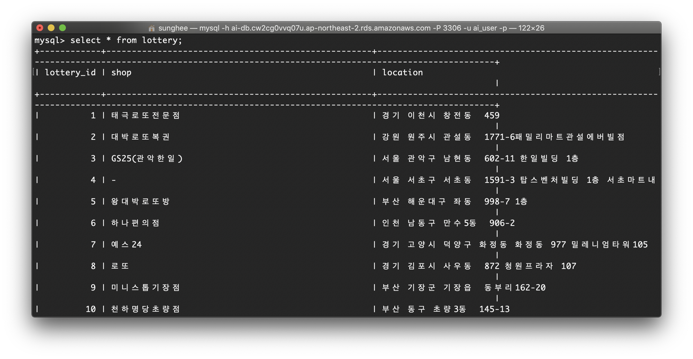

# Lottery-crawler

로또 6/45에서 "자동"으로 구매한 1등의 구매처를 크롤링한다.

> 로또 번호 선택 방법에는 자동, 반자동, 수동 3가지가 있다. 소위 말하는 '로또 명당' 순위는 이 3가지 선택 방법을 모두 포함한 1등 당첨자의 수로 지정되기 때문에 '자동'으로 구매한 1등의 구매처를 크롤링 해보았다.

<br/>

### Architecture

{: width="200" height="200"}

<br/>

###Data Acquisition

판매점 정보 업데이트 시간을 고려하여 매주 일요일에 상호명과 소재지를 수집한다. 

상호명이 같거나 없는 판매점이 있기 때문에 구분을 위해 소재지도 함께 수집한다.

> `crawler.py` 는 amazon lambda를 사용하지 않고 262회차 ~ 853회차 판매점을 크롤링한다.
>
> `lambda_crawler.py` 는 amazon lambda를 사용하여 매주 일요일마다 최신 회차의 판매점을 크롤링한다.
>
> `lambda.zip` 은 사용한 라이브러리와 위의 `lambda_crawler.py` 를 압축한 파일로 amazon lambda에 업데이트한 파일이다.

#### Prerequisites

`mysql -h [Endpoint] -P 3306 -u [user_name] -p` 으로 접속한 후 아래와 같이 테이블을 생성한다.

```mysql
CREATE TABLE lottery ( 
lottery_id INT NOT NULL AUTO_INCREMENT, 
shop VARCHAR(50) NOT NULL, 
location VARCHAR(200) NOT NULL, 
PRIMARY KEY(lottery_id) 
) DEFAULT CHARSET=utf8 COLLATE=utf8_bin;
```

<br/>

### Result

